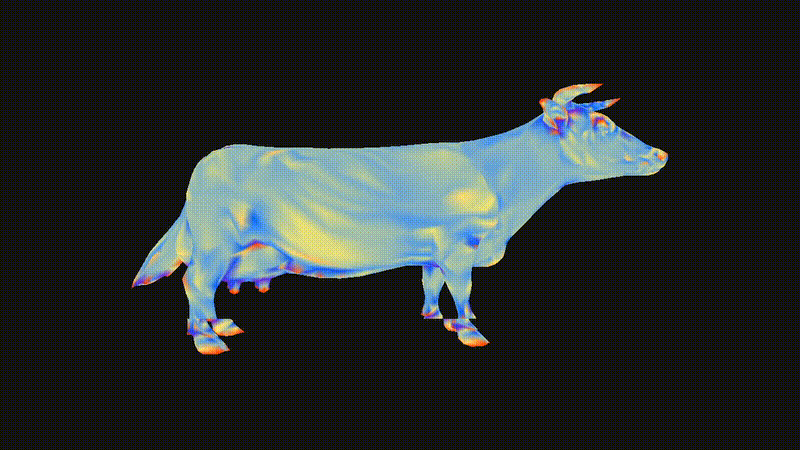
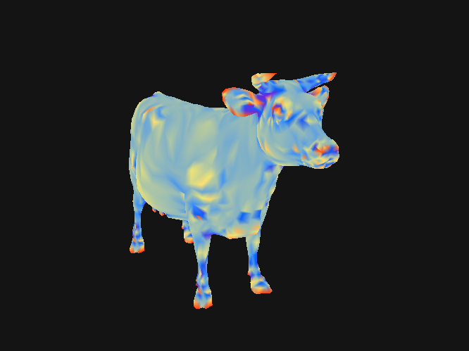
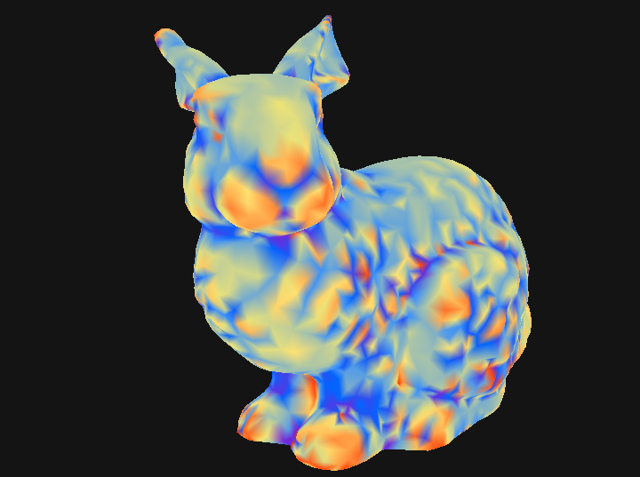
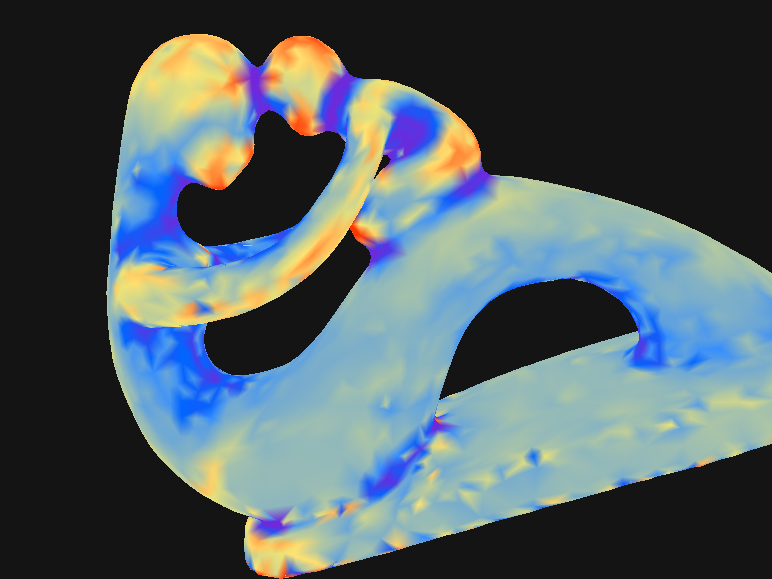
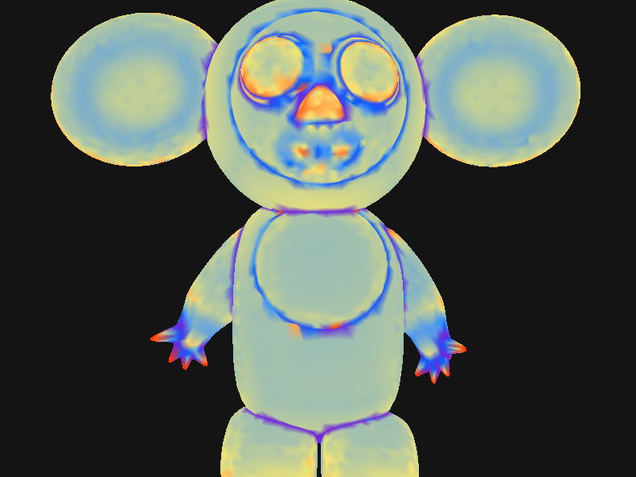
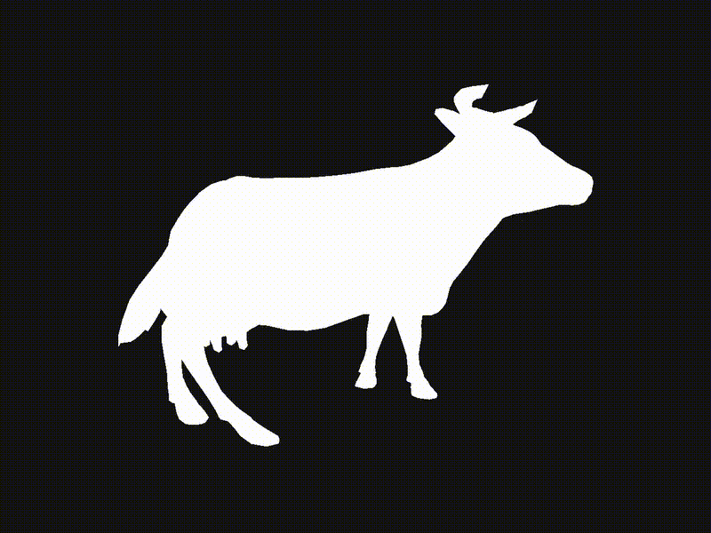

# Dynamic Curvature Visualization of 3D Meshes Using Libigl and OpenGL

A C++ OpenGL framework for loading, processing, deforming and visualizing 3D triangular meshes with curvature-based color mapping.

<div align="center">



</div>

## About
This project presents a system for coloring three-dimensional models based on their curvature during continuous physical deformations, integrating a custom OpenGL-based mini graphics engine for the real-time loading, processing, deformation, and visualization of 3D models from the public libigl repository.  
Libigl is primarily used for geometric mesh processing and model loading, while the engine handles scene abstraction, graphics resource management, geometry updates during deformation and visualization, managing the communication between the CPU and the GPU through the rendering pipeline.

## Objective

The objective of this project was to study and visualize geometric properties of deformable 3D meshes, focusing on curvature computation and mesh deformation processes.

To achieve a deeper understanding of how geometric information is transformed into a visual representation, a custom modular rendering pipeline was developed. The system was designed as a set of independent modules, allowing each stage of the process to be developed, tested, and analyzed separately while maintaining a clear connection between geometric processing and graphical visualization.

This structure enabled the study of the complete workflow, from mesh representation and geometric operations to GPU-based rendering and the final visual output, providing insight into the interaction between computational geometry and graphics.

## Features

- OBJ/OFF mesh loading
- Modular OpenGL renderer
- CPU-GPU mesh upload and update system
- Curvature-based color visualization
- Mesh deformation system
- Docker environment

## Structure
The project is organized into modular components:

```
.
├── include/
│   ├── core/
│   ├── render/
│   ├── io/
│   └── geometry/
│
├── src/
│
├── sanity/
│
├── examples/
│   ├── curvature/
│   ├── deformation/
│   └── combined/
│
├── results/
│
├── utilities/
│   ├── _obj-models/
│   ├── _off-models/
│   ├── vert-shader/
│   └── frag-shader/
│
└── docs/

```

The `src/` and `sanity/` directories follow the same module organization defined in `include/`, with corresponding implementations and tests for each engine component.

The `results/` directory follows the same organization defined in `examples/`, with corresponding visualization results.

### Project Overview

- `include/`: Header files defining the engine modules.
- `src/`: Source files implementing the `.h` files in `include/`.
- `sanity/`: Tests for each module.
- `examples/`: Example applications demonstrating curvature visualization, mesh deformation, and their interaction.
- `results/`: Visualization results.
- `utilities/`: External resources, such as models and shader files.
- `docs/`: Contains the technical documentation of the project, including the initial proposal, software architecture description, environment setup instructions, and module validation procedures.

See [architecture document](docs/architecture.md) for details about the engine modules in `include/` and `src/`.

## Requirements
- Docker
- OpenGL 4.x compatible graphics environment
- X server for graphical output
  - VcXsrv (Windows)
  - X11 (Linux)


## Docker Setup

This project provides a Docker environment with all required dependencies that ensures a consistent development environment across systems. See [docker setup document](docs/docker-setup.md) for details about the Docker image and the launching of the container.

## Compilation and Execution

From the project root directory (inside the Docker container):
```bash
mkdir build
cmake --fresh -S . -B build && cmake --build build
```
Command breakdown:

- `mkdir build` creates a separate directory for generated build files. **Run it only once**.  
- `cmake --fresh -S . -B build` configures the project from the source directory (.) and generates the build system inside build.  
- `cmake --build build` compiles the project using the generated configuration.

After building, executables can be found inside `build/`.  
Run the executables with:
```bash
./build/<category>/<subcategory>/<executable>
```
where `<category>` can be sanity or examples.

For example:
```bash
./build/sanity/render/render-camera-sanity
./build/examples/curvature/curvature-cow-example
```

## Sanity Tests

The project includes sanity tests to verify each module independently.  
See [sanity tests document](docs/sanity-tests.md) for details about sanity tests execution and expected outputs.

## Results
### Some Curvature Results

<div style="display:flex; gap:10px;">
  
  
</div>
<div style="display:flex; gap:10px;">
  
  
</div>

### Some Deformation Results

<div style="display:flex; gap:10px;">
  
</div>

### Some Combined Results

<div style="display:flex; gap:10px;">
  
</div>

## Resources

[project GitHub repository](https://github.com/sebmartinezz/libigl-project-cpp)  
[project Drive repository](https://drive.google.com/drive/folders/1ymkmy3yYDT-SRfTl61svm8XMh8n8oIXk?usp=sharing)

[GLFW documentation](https://www.glfw.org/docs/latest/)  
[GLAD github repository](https://github.com/Dav1dde/glad)  
[OpenGL Khronos API](https://wikis.khronos.org/opengl/index.php?title=Category:Core_API_Reference)  
[OpenGL functions](https://docs.gl/)  
[Libigl library documentation and tutorial](https://libigl.github.io/)  
[Models repository](https://github.com/libigl/libigl-tutorial-data.git)  
[Tanh Scaling](https://medium.com/ai-enthusiast/mastering-tanh-a-deep-dive-into-balanced-activation-for-machine-learning-4734ec147dd9)

## Authors

This project was developed for the course:  
**Programación e Introducción a los Métodos Numéricos**  
**Facultad de Ciencias**  
**Universidad Nacional de Colombia - Sede Bogotá**

Professor:

Oquendo Patiño, William Fernando - wfoquendop@unal.edu.co

Developed by:

- Martínez Sáenz, Sebastián - sebmartinez@unal.edu.co
- Reyes Amarís, Tomás Santiago - treyesa@unal.edu.co
- Bautista Vivas, Elvis Alberto - ebautistav@unal.edu.co
- Ortiz Salazar, Esteban - esortizs@unal.edu.co
